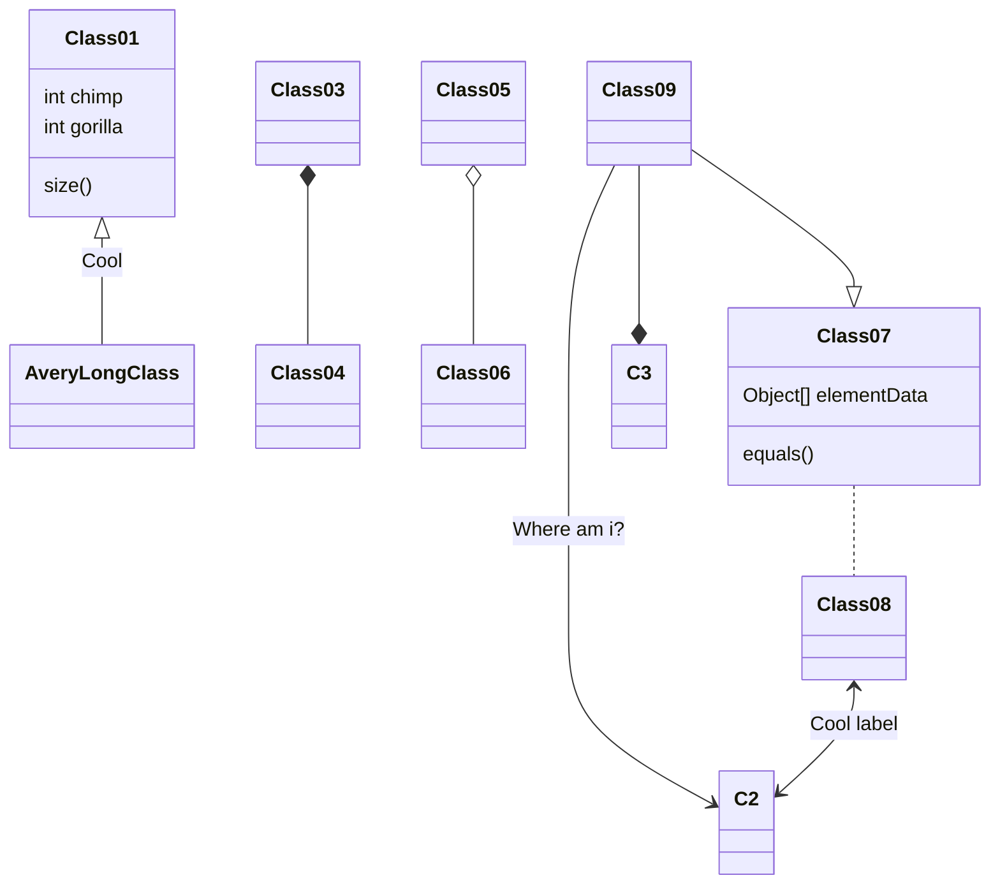

# HorusHeresy-1.0-TTAdmiral
## Purpose: 
__Repository for Horus Heresy 1.0 data for use with Tabletop Admiral army builder__
Supporting Heresy 1.0 given the BattleScribe repos for 1.0 are no longer being maintained, and BattleScribe is now effectively abandon-ware. 

## Implementation

### Factions
- Legiones Astartes
    - I Dark Angels
    - III Emperor's Children
    - IV Iron Warriors
    - ...
    - Blackshields
- Mechanicum
    - Taghamata
    - Legio Cybernetica
    - Ordo Reductor
    - Questoris Knights
- Crusade Imperialis
    - Solar Auxilia
    - Militia and Cults
- Other
    - Daemons of the Ruinstorm
    - Army of Dark Compliance

### Force Orgs
- Crusade
- Allied Detachment
- Onslaught
- Leviathan
- Castelland
- Matrix of Ruin
- Army of Dark Compliance
- Strategic Raid Garrison
- Strategic Raid Raider
- Zone Mortalis Attacker
- Zone Mortalis Defender
- Zone Mortalis Combatant

### Unit Types
- Infantry
    - Boosted
        - Jump Units
        - Jet Pack Units
        
    - Mounted
        - Bikes
        - Jetbikes
        - Cavalry
    - Beasts
    - Monstrous Creatures
        - Flying Monstrous Creatures
        - Gargantuan
        - Flying Gargantuan Creatures
    - Artillery
- Vehicles
    - Transports
    - Flyers
    - Chariots
    - Open-topped Vehicles
    - Heavy Vehicles
    - Fast Vehicles
    - Skimmers
    - Walkers
    - Tanks
    - Super-heavy
        - Super-heavy Vehicles
        - Super-heavy Walkers
        - Super-heavy Flyers

## Links
- <a href="https://modular.tabletopadmiral.com/">Tabletop admiral webclient</a>
- <a href="https://nowforwrath.github.io/data.json">Reference data: Now for Wrath's MESBG datafile</a>
- <a href="https://github.com/BSData/horus-heresy-1e">Reference data: Horus Heresy 1.0</a>
- <a href="https://github.com/BSData/horus-heresy">Reference data: Horus Heresy 2.0</a>

