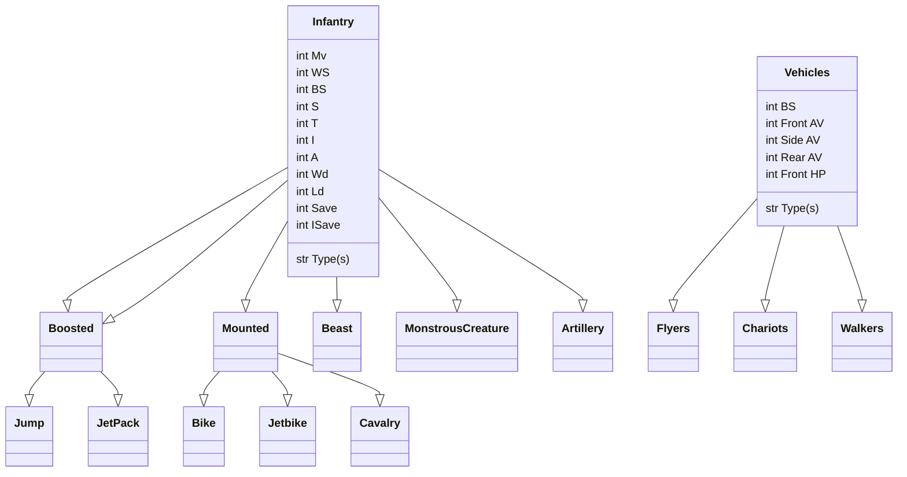

# HorusHeresy-1.0-TTAdmiral
## Purpose: 
__Repository for Horus Heresy 1.0 data for use with Tabletop Admiral army builder__
Supporting Heresy 1.0 given the BattleScribe repos for 1.0 are no longer being maintained, and BattleScribe is now effectively abandon-ware. 

## Implementation
Horus Heresy 1st Edition is based on the Warhammer 6th-7th Edition framework
### Factions
- Legiones Astartes
    - I Dark Angels
    - III Emperor's Children
    - IV Iron Warriors
    - ...
    - Blackshields
- Mechanicum
    - Taghamata
    - Legio Cybernetica
    - Ordo Reductor
    - Questoris Knights
- Crusade Imperialis
    - Solar Auxilia
    - Militia and Cults
- Other
    - Daemons of the Ruinstorm
    - Army of Dark Compliance

### Force Orgs
- Crusade
- Allied Detachment
- Onslaught
- Leviathan
- Castelland
- Matrix of Ruin
- Army of Dark Compliance
- Strategic Raid Garrison
- Strategic Raid Raider
- Zone Mortalis Attacker
- Zone Mortalis Defender
- Zone Mortalis Combatant

### Unit Types
#### List
- Infantry
    - Boosted
        - Jump
        - Jet Pack
    - Mounted
        - Bike
        - Jetbike
        - Cavalry
    - Beast
    - Monstrous Creature
    - Artillery
- Vehicles
    - Flyer
    - Chariot
    - Walker

#### Unit Type Map

## Links
### Client
- <a href="https://modular.tabletopadmiral.com/">Tabletop admiral webApp</a>
### Data files
- <a href="https://nowforwrath.github.io/data.json">Now for Wrath's MESBG datafile</a>
- <a href="https://github.com/BSData/horus-heresy-1e">Horus Heresy 1st</a>
- <a href="https://github.com/BSData/horus-heresy">Horus Heresy 2nd</a>
### Resources
- <a href="https://scoolov.github.io/wh40000rules/home-page/">Wahapedia Warhammer 40k 7th</a>

