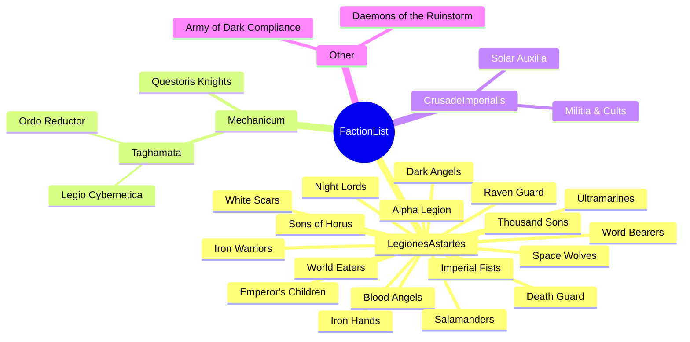
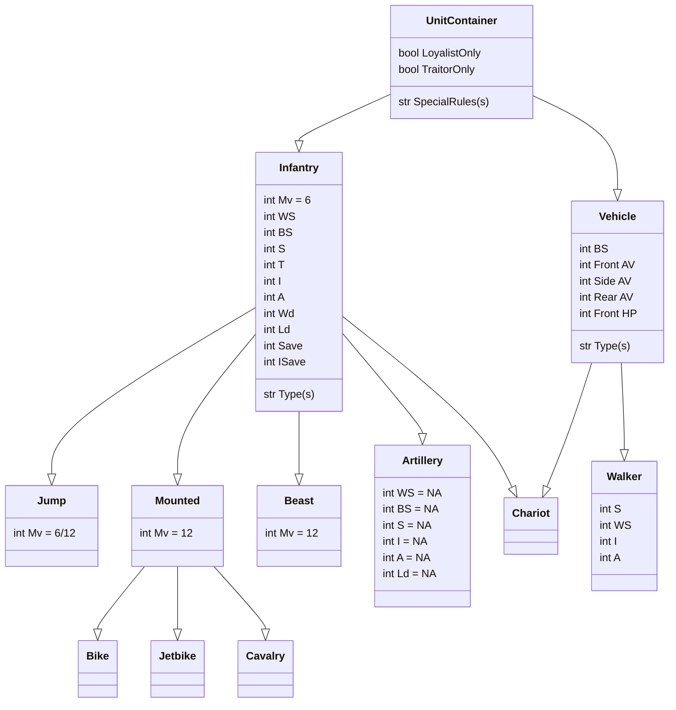

# HorusHeresy-1.0-TTAdmiral
## Purpose: 
__Repository for Horus Heresy 1.0 data for use with Tabletop Admiral army builder__
Supporting Heresy 1.0 given the BattleScribe repos for 1.0 are no longer being maintained, and BattleScribe is now effectively abandon-ware. 

## Implementation
Horus Heresy 1st Edition is based on the Warhammer 6th-7th Edition framework

### Selecting an Army
#### Factions


Groupings where there is no actual faction in that field are for the purposes of the Ally Matrix, where all subfactions are treated as one entry

```json
{
    "name": "Mechanicum"
}, 
{
    "name": "Taghmata",
    "parentFaction": "Mechanicum",
}, 
{
    "name": "Ordo Reductor",
    "parentFaction": "Taghmata",
}
```

#### Force Orgs
- Crusade
- Allied Detachment
- Onslaught
- Leviathan
- Castelland
- Matrix of Ruin
- Army of Dark Compliance
- Strategic Raid Garrison
- Strategic Raid Raider
- Zone Mortalis Attacker
- Zone Mortalis Defender
- Zone Mortalis Combatant

#### Alignment
- Loyalist
- Traitor
- Neutral / 3rd Party

#### Process
1. Faction
0. Force Org
0. Alignment
0. Rite of War (if Legiones Astartes)

### Unit Types
#### List
- Infantry
    - Jet Pack
    - Mounted
        - Bike
        - Jetbike
        - Cavalry
    - Beast
    - Artillery
- Vehicle
    - Flyer
    - Chariot
    - Walker

#### Unit Type Map


### Unit Implementation Plan
#### Examples
##### Angron
```json
{
    "name": "Angron - Lord of the Red Sands",
    "factions": [
        {
            "name": "World Eaters",
            "Crusade-ForceOrgSlot": "HQ"
		},
		{
		    "name": "World Eaters",
            "Crusade-ForceOrgSlot": "Lord of War"
        },
        {
            "name": "Dark Compliance",
            "Crusade-ForceOrgSlot": "Lord of War"
        }			
    ],
    "alignment": [
        {
            "name": "Traitors"
        }
    ], 
    "requiredIn": [
        "Primarch's Chosen",
    ],
    "points": 400ish,
    "movement": 6,
    "weaponSkill": 999,
    "ballisticSkill": 666,
    "strength": 444,
    "toughness": 555,
    "initative": 333,
    "attacks": 333,
    "wounds": 6,
    "leadership": 6,
    "save": 3,
    "invulnSave": 3,
    "UnitType": [
    	"Infantry"
    ],
    "options": [
    	{
    		"name": "a fake upgrade",
    		"points": 40,
    		"availableIn": [
    			"World Eaters"
    		]
    	},
    	{
    		"name": "a fake upgrade",
    		"points": 0,
    		"availableIn": [
    			"Dark Compliance"
    		],
    		"requiredIn": [
    			"Dark Compliance"
    		]
    	}
    ],
    "specialRules": [
    	"Primarch",
    	"..."
    ],
    "wargear": [
    	"Gorechild"
    ]
}
```

##### Garrow
```json
loyalistOnly        =   TRUE
HQ                  =   TRUE
Mechanicum          =   TRUE
LegionesAstartes    =   TRUE
CrusadeImperialis   =   TRUE
```

##### Leman Russ Executioner
```json
HeavySupport        =   TRUE
CrusadeImperialis   =   TRUE
```


## Links
### Client
- <a href="https://modular.tabletopadmiral.com/">Tabletop admiral webApp</a>
### Data files
- <a href="https://nowforwrath.github.io/data.json">Now for Wrath's MESBG datafile</a>
- <a href="https://github.com/BSData/horus-heresy-1e">Horus Heresy 1st</a>
- <a href="https://github.com/BSData/horus-heresy">Horus Heresy 2nd</a>
### Resources
- <a href="https://scoolov.github.io/wh40000rules/home-page/">Wahapedia Warhammer 40k 7th</a>

